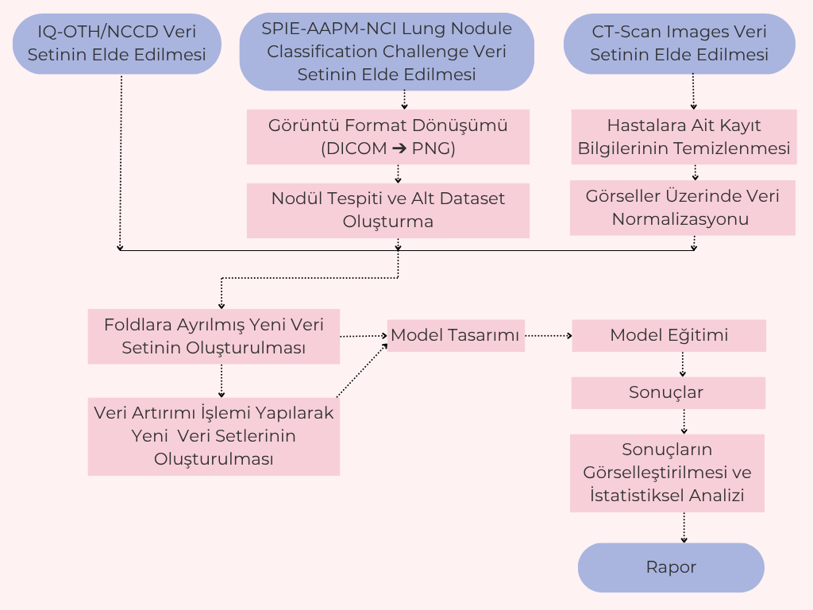

# Bitirme Projesi
# Akciğer BT Görüntülerinin Sınıflandırılmasında CNN ve Transformer Mimarilerinin Performans Karşılaştırması

## 📌 Proje Özeti

Bu projede, akciğer kanseri BT (Bilgisayarlı Tomografi) görüntülerinin sınıflandırılması amacıyla Evrişimsel Sinir Ağları (CNN) ve Transformer mimarileri karşılaştırılmıştır. Amaç, medikal görüntü işleme alanında doğruluğu yüksek, kararlı ve güvenilir modellerin belirlenmesidir. Çalışmada üç açık veri seti kullanılmış; model başarıları doğruluk oranları ve istatistiksel t-testi analizi ile değerlendirilmiştir.

---

## 🔍 Kullanılan Veri Setleri

| Veri Seti         | Görüntü Sayısı | Sınıflar                               |
|-------------------|----------------|----------------------------------------|
| IQ-OTH/NCCD       | 1190           | Normal, Benign, Malignant              |
| SPIE-AAPM-NCI      | 876            | Benign, Malignant                      |
| CT-Scan Images     | 364            | Cancerous, Non-cancerous               |

---

## 🧠 Kullanılan Modeller

| Model             | Türü          | Açıklama |
|------------------|---------------|----------|
| VGG16            | CNN           | Klasik çok katmanlı konvolüsyon yapısı |
| ResNet50         | CNN           | Artık bağlantılarla derin öğrenme kolaylığı |
| EfficientNetV2-S | CNN           | Optimize edilmiş çözünürlük ve derinlik |
| SwinV2           | Transformer   | Pencere kaydırmalı dikkat mekanizması |
| BEiT-Base        | Transformer   | Maskelenmiş görüntü modelleme |
| ConvNeXtV2       | Modern CNN    | Transformer avantajlarıyla güncel CNN tasarımı |
| CoAtNet-1        | Hibrit        | CNN + Transformer birleşimi |

---
## 🔄 Proje Süreci

Aşağıdaki diyagram, proje sürecimizin genel akışını özetlemektedir:

### Süreç Açıklaması

Projeye, üç farklı açık kaynaklı akciğer BT veri setinin toplanmasıyla başlanmıştır: IQ-OTH/NCCD, SPIE-AAPM-NCI ve CT-Scan Images. Her veri seti için ön işleme adımları uygulanmış, görüntü format dönüşümleri (örneğin DICOM → PNG), hasta kayıt bilgilerinin temizlenmesi ve görsellerin normalizasyonu gibi işlemler gerçekleştirilmiştir.

SPIE-AAPM-NCI veri setinde nodül tespiti yapılarak alt veri kümeleri oluşturulmuştur. Tüm veri setleri, 5 katlı stratified K-Fold yöntemiyle fold’lara ayrılmış ve ardından veri artırımı teknikleri (rotasyon, parlaklık-kontrast değişimi, Gauss gürültüsü vb.) uygulanarak eğitim verileri çeşitlendirilmiştir.

Modelleme sürecinde klasik CNN, modern CNN ve Transformer tabanlı modeller geliştirilmiş ve eğitilmiştir. Elde edilen doğruluk değerleri ve başarı metrikleri görselleştirilmiş, istatistiksel anlamlılık ise t-testi ile analiz edilmiştir.

Tüm bu süreç sonunda ulaşılan bulgular raporlanmış ve ilgili görsellerle desteklenmiştir.
---
## 📊 T-Test Sonuçları

### ✔️ Veri Artırımı Uygulanmamış T-Test Tablosu

|                | VGG16 | ResNet50 | EfficientNetV2S | SwinV2 | BEiT-base | ConvNeXtV2 | CoAtNet-1 |
|----------------|-------|----------|------------------|--------|------------|--------------|-------------|
| **VGG16**        |   -   | 0/0/3   | 0/0/3           | 1/2/0 | 1/2/0     | 0/3/0       | 0/3/0      |
| **ResNet50**     | 3/0/0 |   -      | 0/2/1           | 3/0/0 | 2/1/0     | 3/0/0       | 3/0/0      |
| **EfficientNetV2S** | 3/0/0 | 1/2/0   |   -              | 3/0/0 | 3/0/0     | 3/0/0       | 3/0/0      |
| **SwinV2**        | 0/2/1 | 0/0/3   | 0/0/3           |   -     | 0/3/0     | 0/3/0       | 0/2/1      |
| **BEiT-base**     | 0/2/1 | 0/1/2   | 0/0/3           | 0/3/0 |   -         | 0/3/0       | 0/2/1      |
| **ConvNeXtV2**    | 0/3/0 | 0/0/3   | 0/0/3           | 0/3/0 | 0/3/0     |    -         | 0/3/0      |
| **CoAtNet-1**     | 0/3/0 | 0/0/3   | 0/0/3           | 1/2/0 | 1/2/0     | 0/3/0       |     -        |

> **T. Kazanma**: SwinV2 (8), BEiT (7), ConvNeXtV2 (6), CoAtNet-1 (6), VGG16 (6)

---

### ✔️ Veri Artırımı Uygulanmış T-Test Tablosu

|                | VGG16 | ResNet50 | EfficientNetV2S | SwinV2 | BEiT-base | ConvNeXtV2 | CoAtNet-1 |
|----------------|-------|----------|------------------|--------|------------|--------------|-------------|
| **VGG16**        |   -   | 2/1/0   | 3/0/0           | 0/3/0 | 0/3/0     | 0/2/1       | 1/2/0      |
| **ResNet50**     | 0/1/2 |   -      | 2/1/0           | 0/1/2 | 0/1/2     | 0/1/2       | 0/1/2      |
| **EfficientNetV2S** | 0/0/3 | 0/1/2   |   -              | 0/0/3 | 0/0/3     | 0/0/3       | 0/0/3      |
| **SwinV2**        | 0/3/0 | 2/1/0   | 3/0/0           |   -     | 1/2/0     | 0/3/0       | 2/1/0      |
| **BEiT-base**     | 0/3/0 | 2/1/0   | 3/0/0           | 0/2/1 |   -         | 0/2/1       | 0/3/0      |
| **ConvNeXtV2**    | 1/2/0 | 2/1/0   | 3/0/0           | 0/3/0 | 1/2/0     |    -         | 2/1/0      |
| **CoAtNet-1**     | 0/2/1 | 2/1/0   | 3/0/0           | 0/1/2 | 0/3/0     | 0/1/2       |     -        |

> **T. Kazanma**: ConvNeXtV2 (9), SwinV2 (8), VGG16 (6), BEiT (5), CoAtNet-1 (5)

## 📊 T-Test Sonuç Özeti

- ConvNeXtV2, SwinV2 ve BEiT modelleri diğer modellere karşı **istatistiksel olarak anlamlı üstünlük** sağlamıştır.
- Zayıf performans gösteren modellerde veri artırımı doğruluğu artırırken; güçlü modellerde performansı dengelemiş ve istikrarı artırmıştır.

---

## 🛠️ Kullanılan Teknolojiler

- Python, PyTorch
- OpenCV, NumPy, Pandas, Scikit-learn
- Matplotlib & Seaborn (görselleştirme)
- Kaggle ve TCIA veri kaynakları

---

## 👥 Katkıda Bulunanlar

- **Elif Tilki** - [eliftlk34@gmail.com](mailto:eliftlk34@gmail.com)
- **Sude Nur Gülcan** - [sudenur.glcn@gmail.com](mailto:sudenur.glcn@gmail.com)
- **Karun Acar** - [acarkarun@gmail.com](mailto:acarkarun@gmail.com)

---

## 📚 Kaynaklar

1. [IQ-OTH/NCCD Dataset - Kaggle](https://www.kaggle.com/datasets/hamdallak/the-iqothnccd-lung-cancer-dataset)
2. [SPIE-AAPM-NCI Dataset - TCIA](https://www.cancerimagingarchive.net/collection/spie-aapm-lung-ct-challenge/)  
3. [CT-Scan Images - Mendeley](https://doi.org/10.17632/p2r42nm2ty.3)  
4. [VGG16, ResNet, SwinV2, BEiT, ConvNeXt, CoAtNet - arXiv.org](https://arxiv.org/)

---

## 📌 Not

Bu çalışma Marmara Üniversitesi Bilgisayar Mühendisliği Bölümü 2024–2025 yılı Bitirme Projesi kapsamında gerçekleştirilmiştir.
